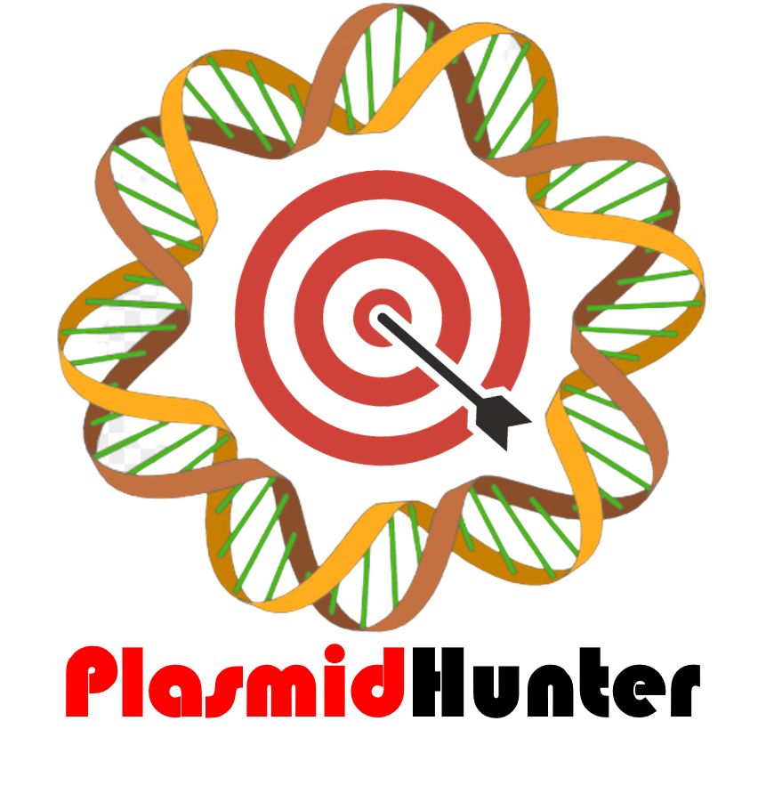

Good News: We have built a Galaxy server at http://hts.iit.edu/galaxy. You can go to http://hts.iit.edu/galaxy/tool_runner?tool_id=plasmidhunter to analyze your data by simply uploading it and waiting. 


<p>
presented by Institute of Food Safety and Health, Illinois Institute of Technology
</p>

# PlasmidHunter: Accurate and Fast Plasmid Prediction Based on Gene Content Using Machine Learning 

Plasmids are extrachromosomal DNA found in microorganisms. They often carry beneficial genes that help bacteria adapt to harsh conditions. Plasmids are also important tools in genetic engineering, gene therapy, and drug production. However, it can be difficult to identify plasmid sequences from chromosomal sequences in genomic and metagenomic data. Here, we have developed a new tool called PlasmidHunter, which uses machine learning to predict plasmid sequences based on gene content profile. PlasmidHunter achieved high accuracies (up to 97.6%) and high speeds in benchmark tests including both simulated contigs and real metagenomic plasmidome data, outperforming other existing tools.

Keywords: artificial intelligence (AI), machine learning (ML), plasmid prediction, genomic sequencing

## Installation and run
```
conda create -n plasmidhunter python=3.10
conda activate plasmidhunter
conda install -c conda-forge -c bioconda -y diamond=2.1.8 prodigal # For Windows users, please install the two packages manually instead.
pip install plasmidhunter
plasmidhunter -h
```
## Result Interpretation
The result is a tab-delimited table showing the prediction of each sequence. The columns include Prediction (0: chromosome, 1: plasmid), Probability of 0 (chromosome), and Probability of 1 (plasmid). 

## Citation
PlasmidHunter: Accurate and fast prediction of plasmid sequences using gene content profile and machine learning

Renmao Tian, Jizhong Zhou, Behzad Imanian

bioRxiv 2023.02.01.526640; doi: https://doi.org/10.1101/2023.02.01.526640

## Contact
If you have any questions, please contact Renmao Tian (tianrenmao[at]gmail.com) or Behzad Imanian (bimanian[at]iit.edu).

## License
Educational Community License, Version 2.0
## Benchmark data
https://zenodo.org/records/10433596
